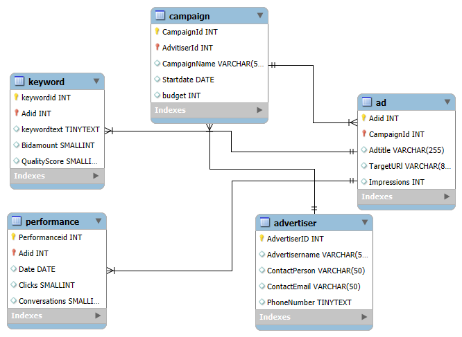
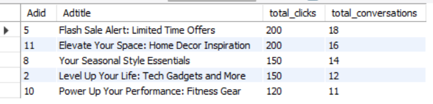

# Google-Ads-Database
Google is a multinational technology company offering online advertising services through the Google Ads platform. As a data analyst, you have been tasked with developing a comprehensive Relational Database Management System (RDBMS) to support Google Ads operations. The goal is to manage advertisers,campaigns,ads, keywords, and performance metrics. 

## Objectives
* Identifying the main entities in the database system.
* Clearly defining the attributes, relationships and constraint that support the business needs.
* Designing an entity relationship diagram that supports the business needs based on the database entities, relatinships and participation constraints.


  
## Main Entities in the table
Entities are tables or real world objects that are meant to store information in the database. They are fundamental component of an Entity Relationship Diagram(ERD).

# Advertiser
This is the table that stores the advertisers' information. The attributes and data types are as follows:<br>
AdvertiserID PK **INT**<br>
AdvertiserName **VARCHAR**<br>
ContactPerson **VARCHAR**<br>
ContactEmail **VARCHAR**<br>

## Campaign
This is the table that stores information from the campaigns. The attributes and data types are as follows:<br>
CampaignID PK **INT**<br>
AdvertiserID FK **INT**<br>
CampaignName **VARCHAR**<br>
StartDate **DATE**<br>

## Advertisement
This is the table that stores information from the advertisement. The attributes and data types are as follows:<br>
AdID PK **INT**<br>
CampaignID FK **INT**<br>
AdTitle **VARCHAR**<br>
TargetURL **VARCHAR**<br>
Impression **SMALLINT**<br>

## keyword
This is the table that stores information from the keyword. The attributes and data types are as follows:<br>
keywordid PK **INT**<br>
adid **INT** FK <br>
keywordtext **TEXT** <br>
Bidamount **SNALLINT** <br>
QualityScore **SMALLINT** <br>

## Performance
This is the table that stores information from the Performance. The attributes and data types are as follows:<br>
Performanceid PK **INT** <br>
Adid FK **INT** <br>
Date **DATE** <br>
Clicks **SMALLINT** <br>
Conversations **SMALLINT** <br>

## The cardinality requirement for the Database
Advertiser - Campaign: One advertiser can manage multiple campaigns, but each campaign belongs to a single advertiser (one-to-many) <br>.
Campaign – Ad: One campaign can contain multiple ads, but each ad is linked to one campaign (one-to-many) <br>.
Ad - Keyword: An ad can target multiple keywords, but each keyword is associated with one ad (one-to-many) <br>.
Ad - Performance: One ad can generate multiple performance records over time, but each performance record belongs to a specific ad (one-to-many) <br>. 

## Entity Relationship Diagram 
The Entity Relationship Diagram shows the collection of objects within a database and the relationship between them. It includes the entities, Schemas, Participation constraints and the relationship between the entities, I modeled this using the ERD tools by defining the table and specifying the relationships between the tabbles using pre-existing columns as foreign keys.

![Google Database Entity Relationship Diagram]

## Advertiser table
```Sql
INSERT INTO Advertiser (AdvertiserID, Advertisername, Contactperson, Contactemail, Phonenumber)
VALUES
(1, 'Simtech Creative', 'Chinwe Okoro', 'chimweokoro@gmail.com', '+234 (0)70 4735 0000'),
(2, 'Gain Infinity - Digital Marketing Agency', 'Emeka Ibe', 'emekaibe@gmail.com', '+234 (0)70 6183 9068'),
(3, 'Businete Digital Agency', 'Kehinde Adebayo', 'kehindeadebayo@yahoo.com', '+234 (0)90 2726 9753'),
(4, 'Algorithm Media', 'Funke Adewale', 'funkeadewale@gmail.com', '+234 (0)70 4735 0001'),
(5, 'Super Stars Promotions Limited', 'Ifeanyi Inwachukwu', 'ifeanyiinwachukwu@yahoo.com', '+234 (0)70 6183 9069'),
(6, 'Stanoz Designs', 'Ngozi Obi', 'ngoziobi@gmail.com', '+234 (0)90 2726 9754'),
(7, 'Alternative Adverts Ltd', 'Tolu Onifade', 'toluonifade@yahoo.com', '+234 (0)70 4735 0002'),
(8, 'Betteroffservice, Advertising Agency', 'Bayo Alabi', 'bayoalabi@gmail.com', '+234 (0)70 6183 9070'),
(9, 'Odichi Solutions', 'Zainab Abdullahi', 'zainababdullahi@yahoo.com', '+234 (0)90 2726 9755'),
(10, 'Gems Communications Ltd', 'Yakubu Danladi', 'yakubudanladi@gmail.com', '+234 (0)70 4735 0003'),
(11, 'Wetherheads, Advertising Group', 'Amara Umeh', 'amaraumeh@gmail.com', '+234 (0)70 6183 9071'),
(12, 'Adhubbing', 'Abdullahi Musa', 'abdullahimusa@yahoo.com', '+234 (0)90 2726 9756'),
(13, 'Ellae Creative', 'Esther Ogunleye', 'estherogunleye@gmail.com', '+234 (0)70 4735 0004');

describe advertiser;
select * from advertiser;
```

## campaign table
``` Sql
INSERT INTO Campaign (CampaignID, advitiserid, CampaignName, StartDate, Budget)
VALUES
(1, 1, 'Unwrap Holiday Joy', '2023-03-21', 800000),
(2, 2, 'Level Up Your Life', '2023-06-15', 1000000),
(3, 3, 'New Arrivals, Just for You', '2023-09-01', 600000),
(4, 4, 'Endless Summer Savings', '2023-12-10', 900000),
(5, 5, 'Flash Deals, Don\'t Miss Out', '2024-01-01', 1000000),
(6, 6, 'Glow Up, Glow Gorgeous', '2024-02-14', 700000),
(7, 7, 'Game-Changing Innovation', '2024-03-21', 850000),
(8, 8, 'Your Seasonal Style Essentials', '2024-06-15', 1100000),
(9, 9, 'Taste the Extraordinary', '2024-09-01', 650000),
(10, 10, 'Power Up Your Performance', '2024-12-10', 950000),
(11, 11, 'Elevate Your Space', '2025-01-21', 1000000),
(12, 12, 'Your Active Lifestyle, Elevated', '2025-02-12', 750000),
(13, 13, 'Luxury Redefined', '2025-03-21', 1200000);

describe campaign;
 ``` 

## Ad table
```Sql
INSERT INTO Ad (AdID, campaignid, AdTitle, TargetURL, Impressions)
VALUES
(1, 1, 'Unwrap Holiday Joy: Your Festive Shopping Guide', 'https://www.simtechcreative.com/holiday-gifts', 10000),
(2, 2, 'Level Up Your Life: Tech Gadgets and More', 'https://www.gaininfinity.com/tech-gadgets', 15000),
(3, 3, 'Discover New Arrivals: Shop Now', 'https://www.businetedigital.com/new-arrivals', 8000),
(4, 4, 'Endless Summer Savings: Your Summer Essentials', 'https://www.algorithmmedia.com/summer-essentials', 12000),
(5, 5, 'Flash Sale Alert: Limited Time Offers', 'https://www.superstarspromotions.com/flash-sale', 20000),
(6, 6, 'Glow Up Your Beauty Routine', 'https://www.stanozdesigns.com/beauty-products', 5000),
(7, 7, 'Innovate Your Life: Tech Gadgets and Trends', 'https://www.alternativeadverts.com/tech-trends', 10000),
(8, 8, 'Your Seasonal Style Essentials', 'https://www.betteroffservice.com/fashion-trends', 15000),
(9, 9, 'Taste the Extraordinary: Gourmet Delights', 'https://www.advertisingagency.com/gourmet-food', 8000 ),
(10, 10, 'Power Up Your Performance: Fitness Gear', 'https://www.odichisolutions.com/fitness-gear', 12000),
(11, 11, 'Elevate Your Space: Home Decor Inspiration', 'https://www.gemscommunications.com/home-decor', 20000 ),
(12, 12, 'Your Active Lifestyle, Elevated', 'https://www.wetherheads.com/active-lifestyle', 5000 ),
(13, 13, 'Luxury Redefined: Indulge Yourself', 'https://www.adhubbing.com/luxury-goods', 10000);
select * from ad;
 ``` 

## Keyword table
``` Sql
INSERT INTO Keyword (KeywordID, ADid, KeywordText, BidAmount, QualityScore)
VALUES
(1, 1, 'holiday gifts', 30.00, 8.5),
(2, 2, 'christmas presents', 25.00, 7.8),
(3, 3, 'tech gadgets', 40.00, 9.2),
(4, 4, 'latest gadgets', 35.00, 8.5),
(5, 5, 'new arrivals', 30.00, 8.0),
(6, 6, 'fashion trends', 25.00, 7.5),
(7, 7, 'summer sale', 45.00, 9.0),
(8, 8, 'beachwear', 38.00, 8.2),
(9, 9, 'flash deals', 40.00, 9.5),
(10, 10, 'limited time offers', 35.00, 8.8),
(11, 11, 'beauty products', 25.00, 7.8),
(12, 12, 'skincare', 20.00, 7.5),
(13, 13, 'tech innovation', 45.00, 9.2);
 select * from keyword;
 ``` 

## Performance table
``` Sql
INSERT INTO Performance (PerformanceID, adid, Date, Clicks, Conversations)
VALUES
(1, 1, '2023-11-01', 100, 5),
(2, 2, '2023-11-02', 150, 12),
(3, 3, '2023-11-03', 80, 7),
(4, 4, '2023-11-04', 120, 10),
(5, 5, '2023-11-05', 200, 18),
(6, 6, '2023-11-06', 50, 3),
(7, 7, '2023-11-07', 100, 8),
(8, 8, '2023-11-08', 150, 14),
(9, 9, '2023-11-09', 80, 6),
(10, 10, '2023-11-10', 120, 11),
(11, 11, '2023-11-11', 200, 16),
(12, 12, '2023-11-12', 50, 4),
(13, 13, '2023-11-13', 100, 9);
select * from performance;
 ```
## Queries supporting the business objectives

## Top five performing advertisements
Firstly insert the performance table 
Based on your table find the best performing advertisement show their adid,adtitle ,sum of clicks and sum of conversions
```Sql
SELECT ad.Adid, ad.Adtitle, SUM(performance.Clicks) AS total_clicks,
    SUM(performance.Conversations) AS total_conversations
FROM Ad JOIN Performance  ON ad.Adid = performance.Adid
GROUP BY ad.Adid, ad.Adtitle
ORDER BY total_conversations DESC, total_clicks DESC
LIMIT 1;
```
## Results


INSIGHT: It can be observed above that Flash Sale Alert


## 2 
Find the top five performing advertisers and their contact emails show their advertiserid, advertisername,contactperson,contactemail,sum of conversions
``` Sql
SELECT  advertiser.Advertiserid, advertiser.AdvertiserName,  advertiser.ContactPerson,  advertiser.ContactEmail,
    SUM(performance.Conversations) AS total_conversions
FROM Advertiser JOIN Campaign ON advertiser.Advertiserid = campaign.Advitiserid
JOIN Ad  ON campaign.Campaignid = ad.Campaignid JOIN Performance ON ad.Adid = performance.Adid
GROUP BY advertiser.Advertiserid, advertiser.AdvertiserName, advertiser.ContactPerson, advertiser.ContactEmail
ORDER BY total_conversions DESC
LIMIT 5;
```
## Result
[Top performing advertisers](question2.png)

## 3
Find the top five campaigns based on impressions
```Sql
use mydb;
select campaign.campaignid, campaign.campaignname, sum(ad.impressions) as total_impressions
 from campaign join ad on campaign.campaignid = ad.campaignid 
 group by campaign.campaignid, campaign.campaignname 
 order by total_impressions desc limit 5;
 ```


